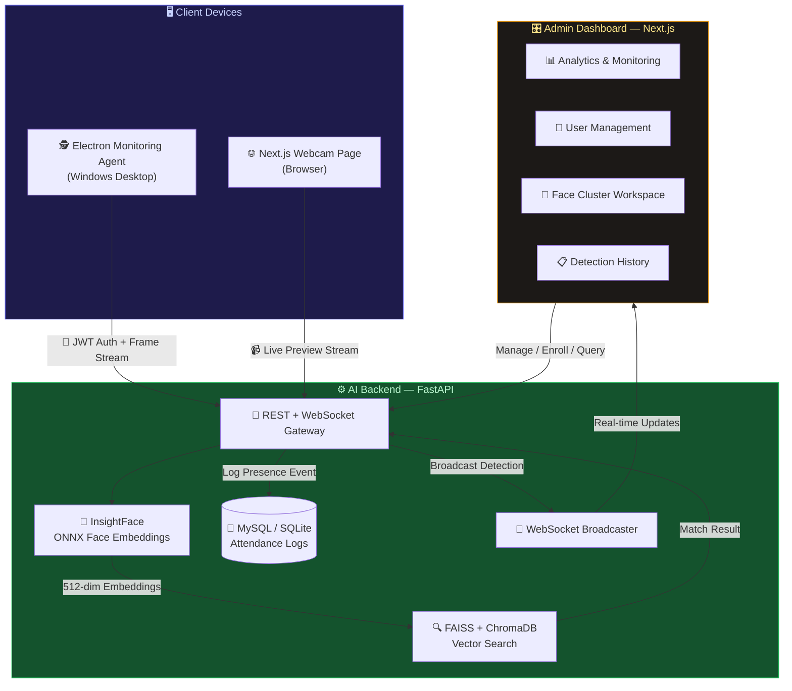
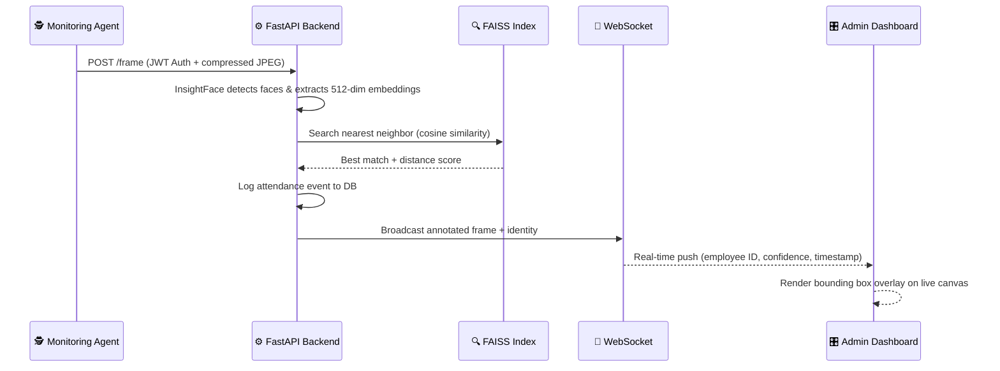

<div align="center">

<h1>
  
</h1>

<p align="center">
  <b>An enterprise-grade, three-tier AI ecosystem for silent employee presence tracking,<br/>real-time face recognition, and intelligent attendance management.</b>
</p>

<br/>

[](https://python.org)
[](https://fastapi.tiangolo.com)
[](https://nextjs.org)
[](https://electronjs.org)
[](https://www.typescriptlang.org)
[](https://tailwindcss.com)

<br/>

[](https://github.com/deepinsight/insightface)
[](https://github.com/facebookresearch/faiss)
[](https://www.trychroma.com)
[](https://sqlalchemy.org)
[](https://developer.mozilla.org/en-US/docs/Web/API/WebSockets_API)
[](./LICENSE)

<br/>

> 🚀 **Three independent services. One unified intelligence.**
> Silent monitoring agent + Admin dashboard + AI backend — all talking in real time.

</div>

---

## 📐 System Architecture

The ecosystem is built as three tightly-integrated, independently deployable modules that communicate over high-performance REST APIs and real-time WebSocket channels.



---

## ✨ Feature Highlights

<table>
<thead>
<tr>
<th align="center">🧠 AI Backend</th>
<th align="center">🖥️ Admin Dashboard</th>
<th align="center">🕵️ Monitoring Agent</th>
</tr>
</thead>
<tbody>
<tr>
<td>

- 512-dim face embeddings via InsightFace + ONNX
- FAISS sub-millisecond vector search
- ChromaDB persistent vector store
- DBSCAN auto-clustering for unknowns
- Continuous learning from confirmed scans
- JWT-secured device authentication
- Real-time WebSocket broadcasting
- Ngrok tunnel for local development

</td>
<td>

- Live camera canvas with bounding boxes
- Confidence score overlays
- Detection & session history logs
- Face cluster workspace (merge, confirm, split)
- User enrollment & photo upload
- Analytics dashboard (known/unknown stats)
- Admin user management panel
- Monitoring session history view

</td>
<td>

- Silent system-tray background process
- Boot auto-start (`openAtLogin`)
- 500 MB offline frame cache (oldest-first eviction)
- Auto-upload queue on reconnect
- Hardware-based device fingerprinting
- 30-second heartbeat protocol
- Encrypted token storage (`safeStorage`)
- Packaged as `.exe` NSIS installer

</td>
</tr>
</tbody>
</table>

---

## 🗂️ Project Structure

```
Face-Detection-system/
│
├── 🔧 backend/                  # FastAPI AI core & database service
│   ├── app/
│   │   ├── core/config.py       # Settings & environment configuration
│   │   ├── models/              # SQLAlchemy ORM models
│   │   ├── routers/             # REST API endpoints
│   │   └── services/            # Face recognition business logic
│   ├── chroma_db/               # ChromaDB vector store (local)
│   ├── uploads/                 # Profile photo storage
│   ├── requirements.txt
│   └── run.py
│
├── 🎨 frontend/                 # Next.js admin & monitoring dashboard
│   └── src/app/
│       ├── dashboard/           # Main monitoring view
│       ├── detections/          # Detection log browser
│       ├── people/              # Face clusters workspace
│       ├── users/               # User management & enrollment
│       ├── admin/               # Admin panel
│       ├── recognition/         # Live recognition feed
│       ├── monitoring-session-history/  # Session audit trail
│       └── login/               # Auth page
│
└── 🕵️ monitoring-agent/         # Electron desktop background agent
    ├── src/
    │   ├── main.ts              # Main Electron process
    │   ├── preload.ts           # Secure context bridge
    │   └── renderer.ts          # UI renderer logic
    └── package.json
```

---

## 🚀 Quick Start

### 📦 Prerequisites

| Requirement | Version | Notes |
|:---|:---:|:---|
| Python | `3.10+` | For the backend AI service |
| Node.js | `18+` | For frontend & monitoring agent |
| npm | `9+` | Package manager |
| C++ Build Tools | Latest | Required on Windows for FAISS compilation |
| MySQL *(optional)* | `8.0+` | Falls back to SQLite if not configured |

---

### 🟢 Step 1 — Backend (FastAPI + AI Engine)

```bash
# 1. Enter the backend directory
cd backend

# 2. Create and activate a virtual environment
python -m venv venv

# Windows
.\\venv\\Scripts\\activate

# macOS / Linux
source venv/bin/activate

# 3. Install all dependencies
pip install -r requirements.txt
```

**Create a `.env` file in the `backend/` directory:**

```ini
# ── Database (leave blank to auto-use SQLite) ──────────────────────────
HOST=127.0.0.1
PORT=3306
USER=root
PASSWORD=your_mysql_password
DB_NAME=face_agent

# ── Face Recognition Algorithm ─────────────────────────────────────────
SIMILARITY_THRESHOLD=0.5          # 0.0–1.0 (lower = stricter match)
SIMILARITY_METRIC=cosine          # cosine | euclidean
EUCLIDEAN_THRESHOLD=0.9

# ── Camera ─────────────────────────────────────────────────────────────
CAMERA_SOURCE=0                   # 0 = default webcam, or RTSP URL

# ── Security ───────────────────────────────────────────────────────────
AUTH_SECRET_KEY=your-secret-key
DEFAULT_ADMIN_USERNAME=admin
DEFAULT_ADMIN_PASSWORD=admin123

# ── Ngrok (optional, for public URL tunneling) ─────────────────────────
NGROK_AUTHTOKEN=your_ngrok_token
NGROK_DOMAIN=your-custom.ngrok-free.dev
```

```bash
# 4. Initialize the database schema (MySQL only)
python scripts/run_init_sql.py

# 5. Start the FastAPI server
python run.py
```

> ✅ Server running at **`http://localhost:8000`**
> 📖 API Docs available at **`http://localhost:8000/docs`**

---

### 🔵 Step 2 — Frontend Dashboard (Next.js)

```bash
# 1. Enter the frontend directory
cd frontend

# 2. Install dependencies
npm install

# 3. Create environment config
```

**Create a `.env.local` file in `frontend/`:**

```ini
NEXT_PUBLIC_BACKEND_URL=http://localhost:8000
NEXT_PUBLIC_FRONTEND_URL=http://localhost:3000
```

```bash
# 4. Launch the development server
npm run dev
```

> ✅ Dashboard available at **`http://localhost:3000`**

---

### 🟣 Step 3 — Monitoring Agent (Electron)

```bash
# 1. Enter the agent directory
cd monitoring-agent

# 2. Install dependencies
npm install

# 3. Start in development mode (compiles TypeScript + launches Electron)
npm start

# 4. Package as a Windows installer (.exe)
npm run package
```

> ✅ Output installer: **`monitoring-agent/dist/CompanyAgentSetup.exe`**
> 💡 Once installed, the agent auto-starts on system boot and runs silently in the system tray.

---

## ⚙️ Configuration Reference

All key parameters live in `backend/app/core/config.py` or your `.env` file:

| Parameter | Type | Default | Description |
|:---|:---:|:---:|:---|
| `SIMILARITY_THRESHOLD` | `float` | `0.5` | Cosine distance threshold for face matching |
| `SIMILARITY_METRIC` | `str` | `cosine` | Comparison metric: `cosine` or `euclidean` |
| `EUCLIDEAN_THRESHOLD` | `float` | `0.9` | Distance threshold for Euclidean metric |
| `CAMERA_SOURCE` | `str` | `0` | Webcam index or RTSP stream URL |
| `UPLOAD_DIR` | `str` | `./uploads` | Server-side profile photo storage path |
| `AUTH_SECRET_KEY` | `str` | *(demo value)* | JWT signing secret — **change in production!** |
| `DEFAULT_ADMIN_USERNAME` | `str` | `admin` | Initial admin login username |
| `DEFAULT_ADMIN_PASSWORD` | `str` | `admin123` | Initial admin login password — **change in production!** |
| `NGROK_AUTHTOKEN` | `str` | `None` | Ngrok auth token for public URL tunneling |
| `NGROK_DOMAIN` | `str` | `None` | Custom Ngrok subdomain |

---

## 🧠 How It Works



---

## 🔒 Security & Resilience

| Feature | Implementation |
|:---|:---|
| **Device Authentication** | Hardware fingerprint (hostname + OS) → JWT token issued at registration |
| **Token Storage** | Electron `safeStorage` API encrypts tokens on the client machine |
| **Offline Resilience** | Agent caches frames locally (≤ 500 MB, FIFO eviction) and auto-uploads on reconnect |
| **Continuous Learning** | Every admin-confirmed match updates the FAISS index, improving accuracy over time |
| **Heartbeat Monitoring** | Agent sends device health status every 30 seconds; dashboard shows Online/Offline state |

---

## 🛠️ Tech Stack At a Glance

| Layer | Technology |
|:---|:---|
| **AI / ML** | InsightFace, ONNX Runtime, FAISS, ChromaDB, scikit-learn (DBSCAN) |
| **Backend** | Python 3.10+, FastAPI, SQLAlchemy, PyJWT, OpenCV, Uvicorn |
| **Database** | MySQL 8 / SQLite (auto-fallback), Alembic migrations |
| **Frontend** | Next.js 15, React, TypeScript, Tailwind CSS 4 |
| **Desktop Agent** | Electron 24, TypeScript, NSIS installer |
| **DevOps / Tunneling** | Ngrok (optional), Git |

---

## 🗺️ Roadmap

- [x] Real-time WebSocket face recognition streaming
- [x] FAISS + ChromaDB dual vector store
- [x] Electron monitoring agent with offline queue
- [x] DBSCAN auto-clustering for unknown faces
- [x] Monitoring session history page
- [ ] Multi-camera support
- [ ] Mobile companion app
- [ ] Cloud deployment (Docker + Kubernetes configs)
- [ ] Face liveness detection (anti-spoofing)
- [ ] Exportable attendance reports (CSV / PDF)

---

## 🛡️ License

This project is **proprietary software**. All rights reserved.
Unauthorized copying, modification, distribution, or use without explicit written permission is strictly prohibited.

---

<div align="center">

Made with ❤️ using **FastAPI · Next.js · Electron · InsightFace**

⭐ If you find this project useful, give it a star!

</div>
