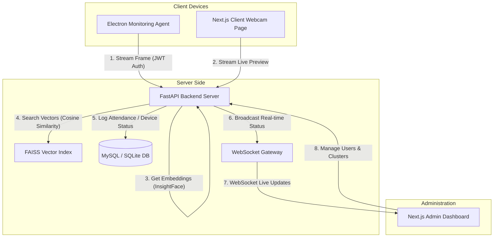

# 📸 Employee Face-Recognition Monitoring & Attendance System

[](https://python.org)
[](https://fastapi.tiangolo.com)
[](https://nextjs.org)
[](https://electronjs.org)
[](https://tailwindcss.com)
[](https://github.com/deepinsight/insightface)
[](https://github.com/facebookresearch/faiss)

An enterprise-grade, three-tier ecosystem for silent employee presence tracking, attendance management, and real-time face recognition. The system leverages state-of-the-art deep learning architectures to capture, analyze, cluster, and report employee presence seamlessly and securely.

---

## 🏗️ System Architecture

The ecosystem consists of three main modules interacting over high-performance REST APIs and real-time WebSockets:



1. **[FastAPI Backend](file:///c:/Users/user/Desktop/face%20recognition%20system/backend)**: The core AI and database service. It runs face detection and feature extraction, manages the vector index, logs attendance states, and provides real-time WebSockets.
2. **[Next.js Frontend Portal](file:///c:/Users/user/Desktop/face%20recognition%20system/frontend)**: An interactive Web UI hosting the administrator command center, live analytics, presence logs, and enrollment forms.
3. **[Electron Monitoring Agent](file:///c:/Users/user/Desktop/face%20recognition%20system/monitoring-agent)**: A silent Windows background desktop client that captures camera frames, manages offline queues when networks fail, and reports device health logs.

---

## ✨ Features

### 1. ⚡ FastAPI AI Core & Backend Service
*   **InsightFace + ONNX Runtime**: Localized high-accuracy face detection and 512-dimension embedding extraction running on CPU.
*   **FAISS Vector Search**: Accelerated, sub-millisecond nearest neighbor search using Facebook AI Similarity Search (FAISS) with configurable Cosine or Euclidean metrics.
*   **Dynamic Clustering (DBSCAN)**: Batch re-clustering algorithm using Scikit-Learn's DBSCAN to group unassigned face instances into canonical clusters automatically.
*   **Continuous Learning & Feedback**: Incorporates user-confirmed face scans directly into the FAISS index to dynamically improve recognition rates over time.
*   **Reactive WebSockets**: Instantly broadcasts annotated frame updates, device statuses, and employee identity detections to administrative dashboards.
*   **Ngrok Integration**: Embedded auto-tunneling capability for secure, direct connection testing on local setups.

### 2. 🖥️ Next.js Admin & Employee Dashboard
*   **Real-time Stream Canvas**: View animated live camera feeds overlaying bounding boxes, matching confidence scores, and employee profile pictures.
*   **Ecosystem Analytics**: Advanced analytics summary tracking total unique known/unknown individuals, presence logs, and total durations.
*   **Albums & Clusters Workspace**:
    *   *Confirm Match*: Validate automated detection guesses to feed the continuous learning vector index.
    *   *Merge Clusters*: Merge duplicate face clusters or match a newly discovered cluster directly into a registered user.
    *   *De-duplicate & Remove*: Clear incorrect matches and isolate specific face scans into a new separate cluster.
*   **User Management**: Quick forms for enrollments, photo uploads, database synchronization, and deletion safety nets.

### 3. 🕵️ Electron Desktop Monitoring Agent
*   **Silent Background Process**: Runs minimized to the system tray, capturing webcam frames invisibly without disrupting user workflow.
*   **Boot Auto-Start**: Registers automatically into OS login settings (`openAtLogin`) with optional `--hidden` flags.
*   **Offline Resiliency Buffer**:
    *   If the backend is offline, the agent caches frames locally as compressed `.jpg` files.
    *   Enforces a strict local cache threshold (under 500MB) using oldest-first cleanup policies.
    *   An offline queue worker polls and uploads cached frames sequentially once connection re-establishes.
*   **Token-Based JWT Security**: Automated initial device registration using hardware metadata (hostname, username, OS release) securing all subsequent live feeds with device-specific JWT tokens.
*   **Heartbeat Protocol**: Broadcasts a heartbeat every 30 seconds to report device status (Online/Offline) and agent software updates.

---

## 📈 Advantages & Edge cases handled

*   **Robust Network Resiliency**: Built-in offline queue prevents data loss during unstable network connections by buffering camera frames locally and uploading them in order when the network recovers.
*   **Zero-Overhead Scale**: Combines the relational power of MySQL/SQLite (for tracking logs, sessions, and device attributes) with the blazing speed of FAISS (for high-dimensional vector searches), keeping the server fast even with large user lists.
*   **Continuous Learning Loop**: Unlike static face templates, every verified face scan acts as a new target vector. The system learns user appearance variations (e.g. lighting, angles, glasses, hair) dynamically without manual re-enrollment.
*   **Secure & Private Credentials**: Sensitive device tokens are encrypted using Electron's native `safeStorage` API, ensuring that credentials stored locally on client computers are safe.

---

## 🚀 Quick Start Guide

### 📦 Prerequisites
-   **Python**: Version 3.10 or higher.
-   **Node.js**: Version 18 or higher (with `npm`).
-   **C++ Build Tools**: Required on Windows to compile FAISS.

---

### 🟢 1. Setting up the Backend

1. Navigate to the backend directory:
    ```bash
    cd backend
    ```
2. Create and activate a Python virtual environment:
    ```bash
    python -m venv venv
    # Windows:
    .\venv\Scripts\activate
    # macOS/Linux:
    source venv/bin/activate
    ```
3. Install dependencies:
    ```bash
    pip install -r requirements.txt
    ```
4. Configure the environment variables by creating a `.env` file:
    ```ini
    # Database Settings (Leave blank to fallback to SQLite automatically)
    HOST=
    PORT=
    USER=
    PASSWORD=your_mysql_password
    DB_NAME=face Agent

    # Algorithm configuration
    SIMILARITY_THRESHOLD=0.5
    SIMILARITY_METRIC=cosine

    # Camera settings
    CAMERA_SOURCE=0

    # Ngrok configuration (optional)
    NGROK_AUTHTOKEN=
    NGROK_DOMAIN=
    ```
5. Initialize the database schema:
    ```bash
    # For MySQL setup (Runs initialization script)
    python scripts/run_init_sql.py
    ```
6. Start the FastAPI server:
    ```bash
    python run.py
    ```
    The server will start at `http://localhost:8000` (or your public ngrok URL if configured).

---

### 🔵 2. Setting up the Next.js Frontend

1. Navigate to the frontend directory:
    ```bash
    cd frontend
    ```
2. Install npm dependencies:
    ```bash
    npm install
    ```
3. Configure your local environment in a `.env.local` file:
    ```ini
    NEXT_PUBLIC_BACKEND_URL=http://localhost:8000
    NEXT_PUBLIC_FRONTEND_URL=http://localhost:3000
    ```
4. Start the development server:
    ```bash
    npm run dev
    ```
    Open `http://localhost:3000` in your web browser.

---

### 🟣 3. Setting up the Monitoring Agent

1. Navigate to the agent directory:
    ```bash
    cd monitoring-agent
    ```
2. Install npm dependencies:
    ```bash
    npm install
    ```
3. Compile TypeScript files and start the Electron application:
    ```bash
    # Development run:
    npm start
    ```
4. Package the application for installation (builds NSIS Setup `.exe` on Windows):
    ```bash
    npm run package
    ```
    The output setup executable will be located in the `dist/` folder as `CompanyAgentSetup.exe`.

---

## 🛠️ Configuration & Customization

Key application parameters can be tuned in `backend/app/core/config.py` or through your `.env` file:

| Parameter | Type | Default | Description |
| :--- | :---: | :---: | :--- |
| `SIMILARITY_THRESHOLD` | `float` | `0.5` | Threshold for matching faces in Cosine distance. |
| `SIMILARITY_METRIC` | `str` | `cosine` | Metric used for comparisons: `cosine` or `euclidean`. |
| `EUCLIDEAN_THRESHOLD` | `float` | `0.9` | Distance threshold when using `euclidean` metric. |
| `CAMERA_SOURCE` | `str` | `0` | Camera index or network video feed URL (RTSP). |
| `UPLOAD_DIR` | `str` | `./uploads` | Folder path on the server for storing profile pictures. |

---

## 🛡️ License

This project is proprietary. All rights reserved.
